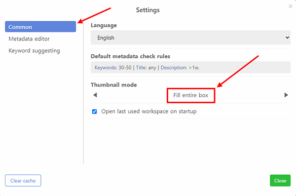
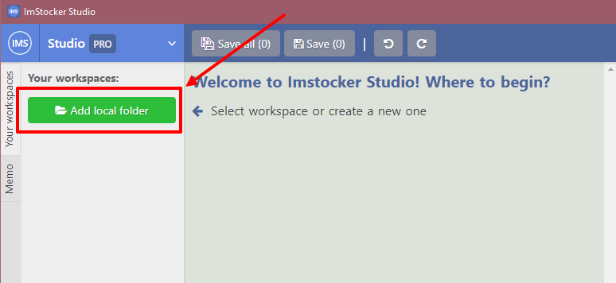

# ImStocker Studio Guide

## Beginning of work

### First launch 

The IMS Studio software is available for download on the main site [https://imstocker.com/](https://imstocker.com/)

When you click on the IMS Studio button, a window for selecting the user's operating system will open. Select and click on the download button.

After installation and launch, you will be greeted with a welcome window, from which you can log in and register in the program:

Registration in the service is quick and easy, without filling out questionnaires.

And for cases when the deadline is upon you and every second counts, there is a way to enter instantly and anonymously, skipping the registration stage:

When you first enter the program, you will see the **main window**, which will politely tell you how to start your work with **IMStocker Studio**:

### Main window

The functionality is divided into the following areas:

**1** - Basic program control, context menu, workspaces, metadata buffer tool

**2** - Contents of the workspace, navigation within the folder, saving, canceling actions

**3** - File preview, boxes for filling metadata: title, description, keywords

### Main menu

The main menu contains **Settings**, the ability to update the program to the **PRO** version, brief information about the program, a feedback button with the developer, as well as the ability to **change the user** and **exit**.

In the **Program Settings**, you can change the language of use, configure the default rules for checking metadata, and change the display mode for thumbnails:

### Working areas

The main interactions with files in **IMStocker Studio** take place through “**workspaces**”. Workplace is a folder that contains the files for editing. To get started, you need to add a new folder using the "**Add local folder**" button:

