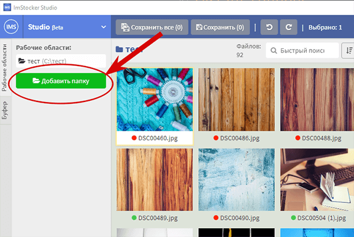
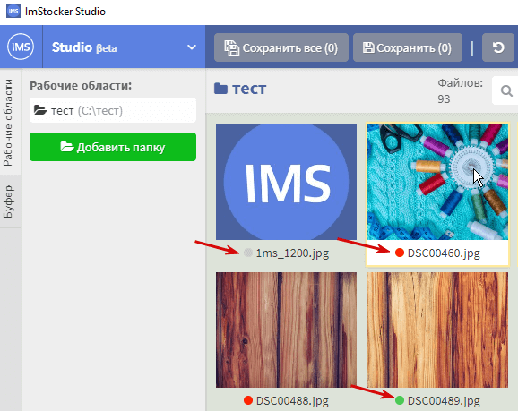
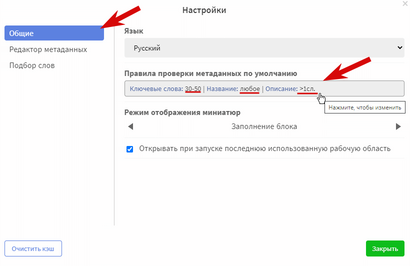
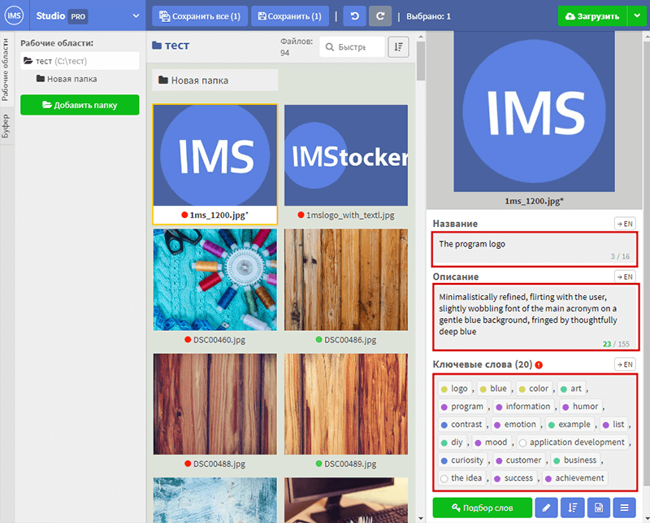
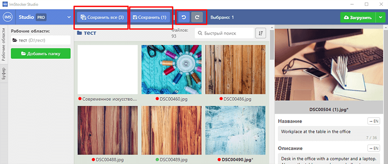
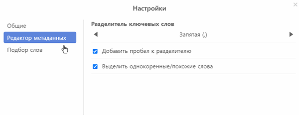
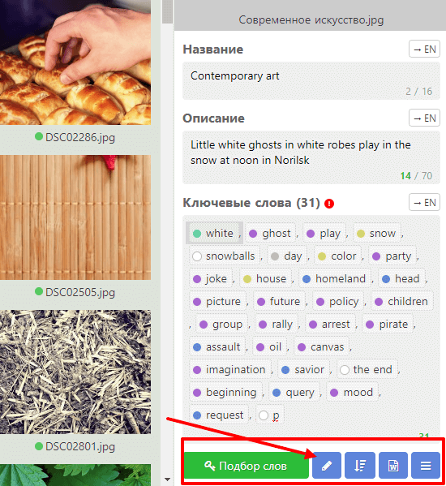

# Руководство по ImStocker Studio

## Начало работы

### Первый запуск

Программа **IMS Studio** доступна для скачивания на основном сайте [https://imstocker.com/](https://imstocker.com/)

При нажатии на кнопку IMS Studio откроется окно выбора операционной системы пользователя. Выбираем и нажимаем на кнопку скачивания.

После установки и запуска, вас встретит окно приветствия, с которого можно осуществить вход и регистрацию в программе:

Регистрация в сервисе быстрая и легкая, без заполнения анкет.

А для случаев, когда дедлайн уже дышит в спину и «нет времени объяснять» есть возможность зайти мгновенно и анонимно, пропуская этап регистрации:

При первом входе в программу вы увидите **главное окно**, которое вежливо подскажет откуда начать вашу работу с **IMStocker Studio**:

### Главное окно

Функционал разделен на следующие области:

**1** - Основное управление программой, контекстное меню, рабочие области, инструмент буфера метаданных
**2** - Содержимое рабочей области, навигация внутри папки, сохранение, отмена действий
**3** - Предпросмотр файла, боксы заполнения метаданных: название, описание, ключевые слова

### Главное меню

Главное меню управления программой содержит **Настройки**, возможность обновить программу до **PRO** версии, краткую информацию о программе, кнопку обратной связи с разработчиком, а также возможность сменить пользователя и выйти.

В **Настройках** программы можно поменять язык пользования, настроить правила проверки метаданных по умолчанию,  а также изменить режим отображения миниатюр:

### Рабочие области

Основное взаимодействие с файлами в программе **IMStocker Studio** происходит через “рабочие области”. Рабочая область - это папка, содержащая файлы для редактирования. Для начала работы необходимо добавить новую папку можно с помощью кнопки “**Добавить папку**”:

Папка может содержать файлы 2 типов: **JPG** и **EPS**, а также объединенный формат **JPG + EPS** с которыми работает программа.
Содержимое выбранной папки появится в области отображения миниатюр.
Тут же их можно отсортировать удобным для вас образом или быстро найти нужный файл:

### Контекстное меню

При нажатии правой кнопки мыши на любой из файлов рабочей области выходит контекстное меню:

Оно позволяет быстро открыть файл для просмотра в проводнике, скопировать или вставить скопированные метаданные, а так же переназвать или переместить файл в другую Рабочую область/Папку.

### Статусы файлов

При загрузке содержимого папки в области отображении миниатюр, каждый файл получит индикатор заполненности метаданных(кругляшок у названия файлов): 

**Зеленый** - все заполнено
**Красный** - заполнено частично
**Серый** - ничего не заполнено

Настроить правила проверки метаданных по умолчанию можно в общих настройках:

## Редактирование файлов

### Редактирование метаданных

Редактирование метаданных выбранного файла происходит в правой части программы. Редактор состоит из трех боксов: **Название**, **Описание**, **Ключевые слова**.
После редактирования метаданных одного или нескольких файлов можно либо сохранить результат текущего активного файла, или все внесенные изменения сразу, а так же в любой момент отменить или повторить внесенные изменения:

Для удобства пользователя существует механизм изменения визуального отображения ключевых слов. Находится он в **Настройки - Редактор метаданных:**

В правом нижнем углу программы находится несколько функций значительно упрощающих работу с ключевыми словами: 

Кнопка “**Преобразовать ключевые слова**” позволяет вносить быстрые изменения во все ключевые слова одновременно: перевод слов в единичное/множественное число, а также возможность удалить однокоренные/похожие слова, слова превышающие установленный лимит и слова с ошибками.

Кнопка “**Отсортировать по..**”  позволяет в целях удобства отображения отсортировать ключевые слова по популярности, количеству скачиваний, алфавиту в прямом и обратном порядке, а также случайным образом.

Кнопка “**Шаблоны**” позволяет создать ваш собственный набор ключевых слов, и быстро применить его в случае надобности, значительно упрощает работу с ключевыми словами в случае, если вы работаете с большим количеством однотипных картинок/фотографий.

Кнопка “**Меню**” позволяет работать с функциями импорта/экспорта метаданных, а также с буфером метаданных.

### Подбор ключевых слов

