# Руководство по ImStocker Studio

## Начало работы

### Первый запуск

Программа **IMS Studio** доступна для скачивания на основном сайте [https://imstocker.com/](https://imstocker.com/)

При нажатии на кнопку IMS Studio откроется окно выбора операционной системы пользователя. Выбираем и нажимаем на кнопку скачивания.

После установки и запуска, вас встретит окно приветствия, с которого можно осуществить вход и регистрацию в программе:

Регистрация в сервисе быстрая и легкая, без заполнения анкет.

А для случаев, когда дедлайн уже дышит в спину и «нет времени объяснять» есть возможность зайти мгновенно и анонимно, пропуская этап регистрации:

При первом входе в программу вы увидите **главное окно**, которое вежливо подскажет откуда начать вашу работу с **IMStocker Studio**:

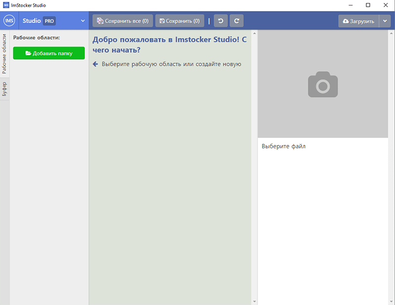

### Главное окно

Функционал разделен на следующие области:

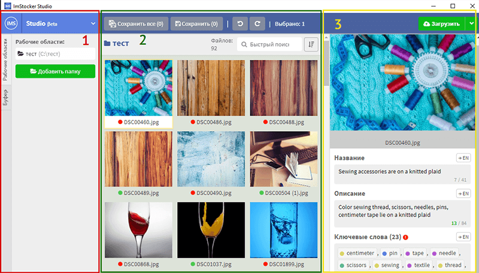

**1** - Основное управление программой, контекстное меню, рабочие области, инструмент буфера метаданных
**2** - Содержимое рабочей области, навигация внутри папки, сохранение, отмена действий
**3** - Предпросмотр файла, боксы заполнения метаданных: название, описание, ключевые слова

### Главное меню

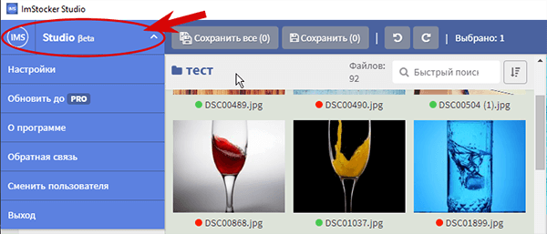

Главное меню управления программой содержит **Настройки**, возможность обновить программу до **PRO** версии, краткую информацию о программе, кнопку обратной связи с разработчиком, а также возможность сменить пользователя и выйти.

В **Настройках** программы можно поменять язык пользования, настроить правила проверки метаданных по умолчанию,  а также изменить режим отображения миниатюр:

### Рабочие области

Основное взаимодействие с файлами в программе **IMStocker Studio** происходит через “рабочие области”. Рабочая область - это папка, содержащая файлы для редактирования. Для начала работы необходимо добавить новую папку можно с помощью кнопки “**Добавить папку**”:

Папка может содержать файлы 2 типов: **JPG** и **EPS**, а также объединенный формат **JPG + EPS** с которыми работает программа.
Содержимое выбранной папки появится в области отображения миниатюр.
Тут же их можно отсортировать удобным для вас образом или быстро найти нужный файл:

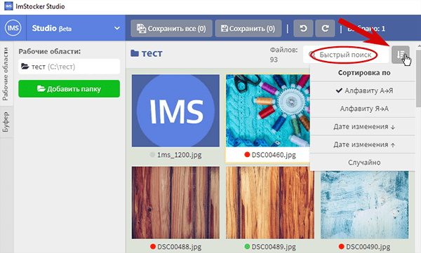

### Контекстное меню

При нажатии правой кнопки мыши на любой из файлов рабочей области выходит контекстное меню:

Оно позволяет быстро открыть файл для просмотра в проводнике, скопировать или вставить скопированные метаданные, а так же переназвать или переместить файл в другую Рабочую область/Папку.

### Статусы файлов

При загрузке содержимого папки в области отображении миниатюр, каждый файл получит индикатор заполненности метаданных(кругляшок у названия файлов): 

**Зеленый** - все заполнено
**Красный** - заполнено частично
**Серый** - ничего не заполнено

Настроить правила проверки метаданных по умолчанию можно в общих настройках:

## Редактирование файлов

### Редактирование метаданных

Редактирование метаданных выбранного файла происходит в правой части программы. Редактор состоит из трех боксов: **Название**, **Описание**, **Ключевые слова**.
После редактирования метаданных одного или нескольких файлов можно либо сохранить результат текущего активного файла, или все внесенные изменения сразу, а так же в любой момент отменить или повторить внесенные изменения:

Для удобства пользователя существует механизм изменения визуального отображения ключевых слов. Находится он в **Настройки - Редактор метаданных:**

В правом нижнем углу программы находится несколько функций значительно упрощающих работу с ключевыми словами: 

Кнопка “**Преобразовать ключевые слова**” позволяет вносить быстрые изменения во все ключевые слова одновременно: перевод слов в единичное/множественное число, а также возможность удалить однокоренные/похожие слова, слова превышающие установленный лимит и слова с ошибками.

Кнопка “**Отсортировать по..**”  позволяет в целях удобства отображения отсортировать ключевые слова по популярности, количеству скачиваний, алфавиту в прямом и обратном порядке, а также случайным образом.

Кнопка “**Шаблоны**” позволяет создать ваш собственный набор ключевых слов, и быстро применить его в случае надобности, значительно упрощает работу с ключевыми словами в случае, если вы работаете с большим количеством однотипных картинок/фотографий.

Кнопка “**Меню**” позволяет работать с функциями импорта/экспорта метаданных, а также с буфером метаданных.

### Подбор ключевых слов

В правом нижнем углу программы можно также найти интегрированный сервис подбора **ImStocker Keyworder**, позволяющий быстро подобрать ключевые слова, использующиеся на стоках, с помощью ряда удобных фильтров. 

Для того чтобы воспользоваться сервисом **ImStocker Keyworder**, необходимо выделить один или несколько файлов, к которым вы будете подбирать слова, и нажать кнопку “**Подбор слов**”: 

Для получения первых результатов, в окне поиска достаточно:
  **1** Ввести одно ключевое слово и нажать клавишу  Enter или кнопку поиска
  

  **2** Выбрать одну или несколько из ассоциирующихся с этим словом всплывших картинок:
  
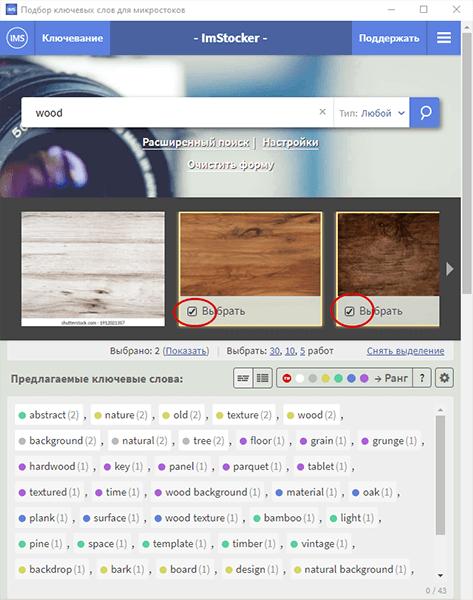
  
Найденные по результатом поиска ключевые слова можно быстро отсортировать по **Рангу**: 

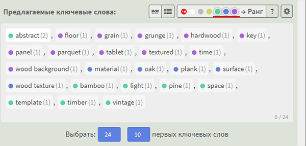

**Ранг** ключевого слова зависит от скачивания, просмотров, уровня конкурентности и трендов и отображается с помощью цветного круга рядом с ключевым словом:

**0 - Белый цвет** означает, что в базе ImStocker еще недостаточно информации, чтобы сделать вывод продающее это слово или нет
**1 - Серый цвет** означает плохой ранг. Слово, либо очень часто используется, либо работы с ним не покупают
**2 - Желтый цвет** означает низкий ранг. Не рекомендуется использовать слишком много таких слов при ключевании
**3 - Зеленый цвет** означает нормальный ранг. Это слово достаточно востребовано и не слишком конкурентно
**4 - Синий цвет** означает хороший ранг.
**5 - Фиолетовый цвет** означает отличный ранг. Низкая конкуренция, высокие продажи

Кроме сортировки по рангам в этом же окне можно посмотреть перевод ключевых слов: 

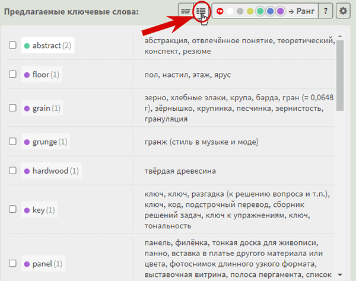

А также более тщательно настроить отображение результатов поиска в настройках предлагаемых ключевых слов: 

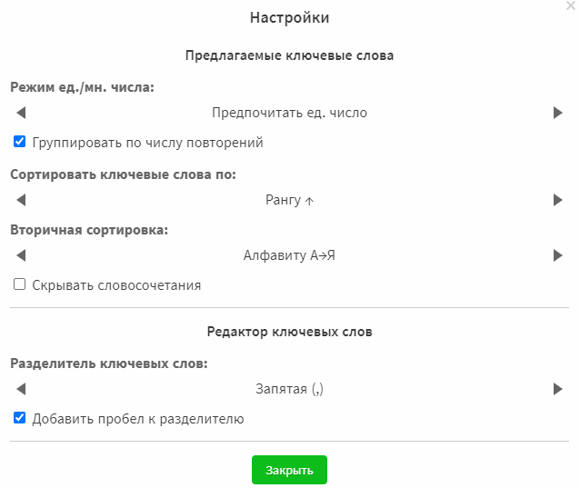

Среди всех найденных ключевых слов необходимо выбрать те, которые вы будете использовать и отметить их нажатием левой кнопки. Каждое отмеченное слово переходит вниз в специальный бокс, для дальнейшего использования:

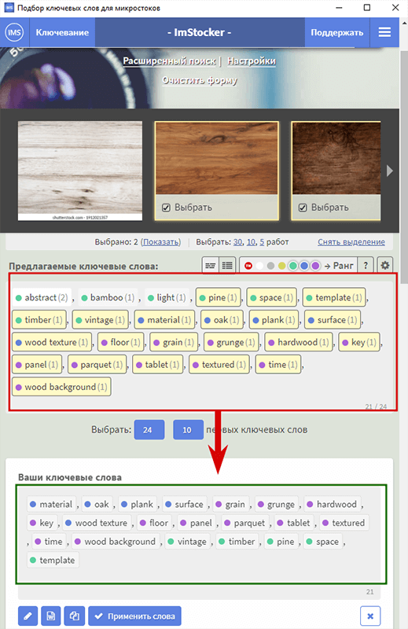

Все выбранные вами ключевые слова можно сразу применить кнопкой “**Применить слова**” к файлу/файлам в вашей рабочей области:

С помощью кнопки “**Редактировать**” выбранные слова можно:
   - Отсортировать по рангу, алфавиту в прямом и обратном порядке, по количеству скачиваний или в случайном порядке.
   - Преобразовать ключевые слова одновременно: перевод слов в единичное/множественное число, а также возможность удалить однокоренные/похожие слова, слова превышающие установленный лимит и слова с ошибками.
   - Настроить небольшие визуальные параметры отображения

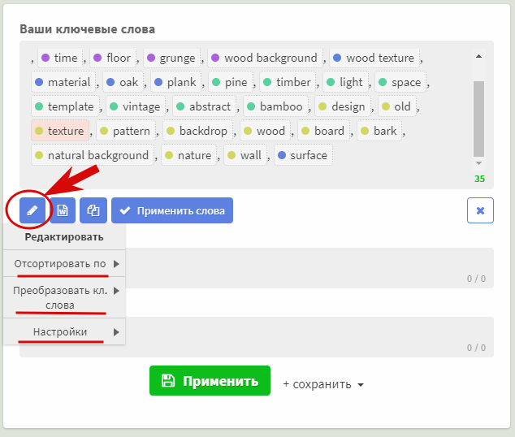

С помощью кнопки “**Шаблоны**” можно создать новый или отредактировать уже созданные вами шаблоны. При нажатии на созданный вами шаблон, откроются содержащиеся в нем ключевые слова: 

Выбранные левой кнопкой слова из этого шаблона добавятся в бокс “**Ваши ключевые слова**”. Внутри шаблона можно добавить все слова сразу кнопкой “**Выбрать всё**”, добавить одно/несколько случайных слов кнопкой “**Выбрать случайно**” либо внести изменения в состав или название самого шаблона кнопкой “**Редактировать**”. Либо удалить данный шаблон полностью.

Эта же кнопка содержит функционал “**Управления шаблонами**”, который позволит вам экспортировать созданные шаблоны во внешний файл формата **.csv** либо импортировать шаблоны из такого же файла.

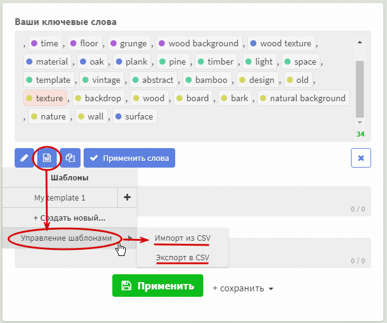

После того как список ключевых слов сформирован и полностью вас устраивает,  а работа с **ImStocker Keyworder** завершена, результат можно **Применить** к выбранным картинкам в рабочей области **ImStocker Studio** и выбрать что сделать с окном **ImStocker Keyworder**: 

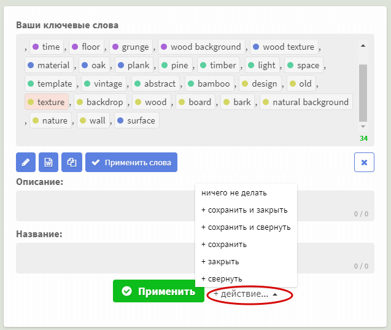

При любом из выбранных вариантов **Ваши ключевые слова**, а также содержание боксов **Описание** и **Название** применится к выбранному файлу/файлам рабочей области, действие из контекстного меню относится только к окну сервиса **ImStocker Keyworder**. 

Небольшие настройки поведения окна **ImStocker Keyworder** можно поменять в **Главное меню/Настройки/Подбор слов**: 

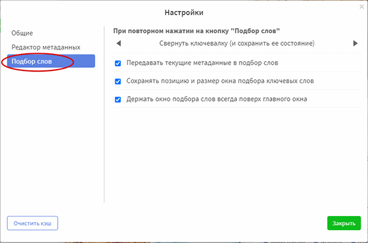

### Перевод метаданных (PRO)

**Перевод метаданных** - одно из преимуществ, доступное в **PRO** версии **IMStocker Studio**. Позволяет мгновенно перевести с русского на английский язык метаданные файла. Каждый бокс переводится отдельной кнопкой:

### Копирование/вставка метаданных

В программе **IMStocker Studio** реализован механизм копирования всех метаданных файла для применения к одному/нескольким файлам рабочей области, что позволяет сэкономить значительное количество времени при работе с большой библиотекой картинок/фотографий. 
Скопировать метаданные файла можно несколькими способами:

Через контекстное меню: при нажатии правой кнопки мыши по выделенной картинке появится контекстное меню, переходим в раздел **Метаданные** и нажимаем **Скопировать метаданные в Буфер**:

Для применения скопированных метаданных к одному или нескольким файлам, выделяем нужные картинки и нажимаем правой кнопкой мыши - **Метаданные** - **Вставить метаданные из буфера**:

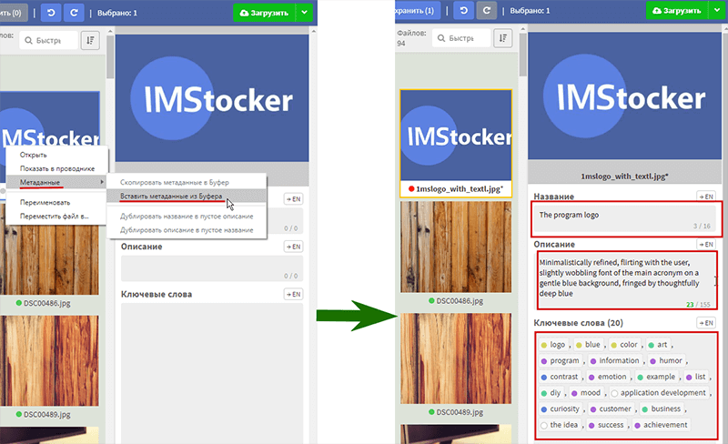

Метаданные скопируются и будут идентичны метаданным исходной картинки.

Второй способ скопировать метаданные - через панель редактирования в правом нижнем углу программы. Нажимаем кнопку **Меню** и выбираем пункт **Скопировать метаданные в Буфер**, далее выделяем один или несколько файлов куда необходимо скопировать метаданные и нажимаем **Вставить метаданные из Буфера**:

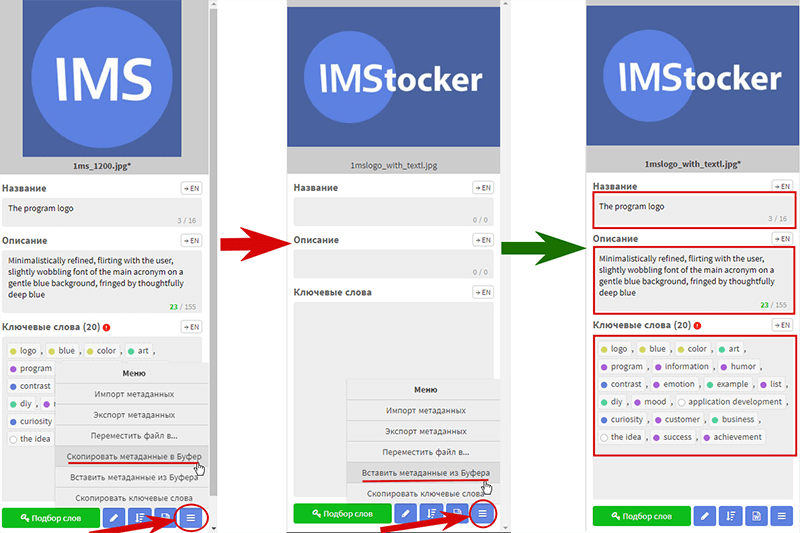

В любой момент работы с копированием метаданных вы можете посмотреть что на данный момент скопировано в буфер, а также в случае необходимости внести корректировки перед вставкой метаданных в другой файл. Для этого переходим в раздел **Буфер**:

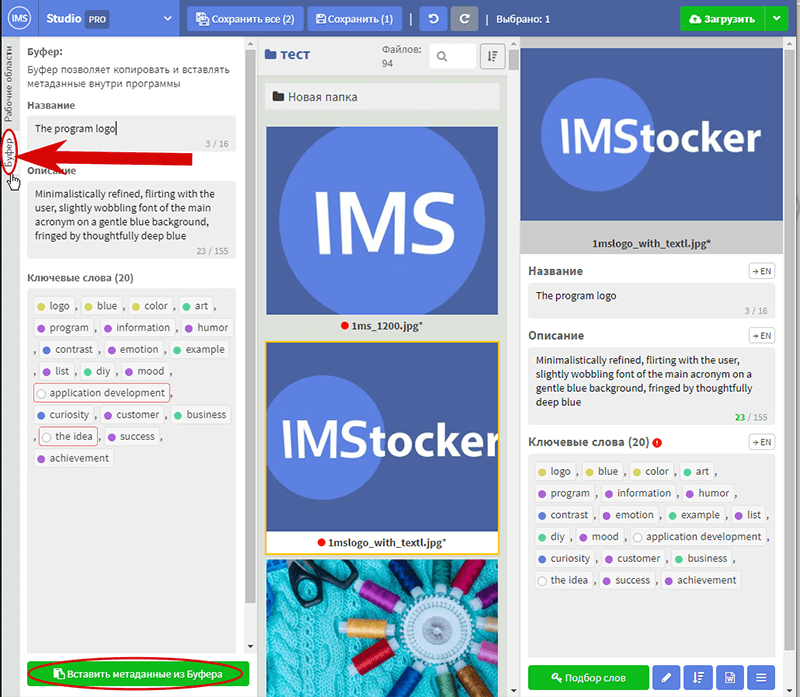

В данном разделе также присутствует кнопка **Вставить метаданные из Буфера** которая применит всё что есть в буфере к выбранному в середине экрана файла.

### Множественный выбор

Возможность редактирования сразу нескольких файлов позволит вам сэкономить время при работе с множеством похожих картинок. Для редактирования нескольких файлов их необходимо выделить левой кнопкой мыши, предварительно зажав клавишу **Ctrl**. Все выделенные картинки объединятся в группу, её состав и количество выбранных файлов отобразится в правом верхнем углу программы:

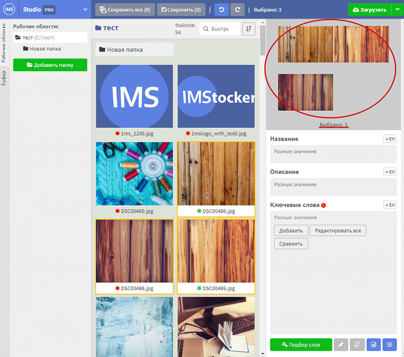

Всё что вы введете в этом режиме в боксы **Название** и **Описание** заменит содержание этих боксов каждой из выделенных картинок. Ключевые слова можно либо **Редактировать все**, то есть полностью заменить ключевые слова исходных картинок введенными, либо **Добавить** что дополнит введенными словами исходные ключевые слова картинок.

### Шаблоны

Работа с шаблонами в **IMStocker Studio** позволит вам значительно ускорить процесс добавления ключевых слов к файлам. Меню управления шаблонами находится в правом нижнем углу программы и появляется при выделении любой картинки из рабочей области:

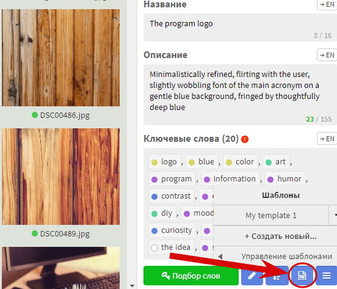

В данном меню отображается список уже созданных шаблонов, кнопка для создания нового шаблона, а также возможность импорта шаблонов из файла **.csv** или экспорта ваших шаблонов в подобный файл.
При нажатии на один из ваших шаблонов, откроется окно, содержащее в себе ключевые слова объединенные в шаблон. Совпадающие по содержанию с выделенным файлом ключевые слова будут отмечены, а все слова которые вы отметите внутри шаблона мгновенно добавятся в список ключевых слов выделеннонр файла. В этом же окне шаблон можно **Редактировать** или **Удалить**, добавить все ключевые слова разом кнопкой **Выбрать всё**, или несколько случайных слов кнопкой **Выбрать случайно**.

Функция **Импорта/Экспорта** шаблонов, позволит вам передавать шаблоны между своими устройствами или другими пользователями.

## Управление файлами

### Экспорт метаданных (PRO)

Экспорт метаданных одна из ключевых особенностей **PRO** версии **IMStocker Studio**, позволяющая в несколько нажатий выгрузить метаданные выбранных картинок в отдельный файл формата **.csv**.
